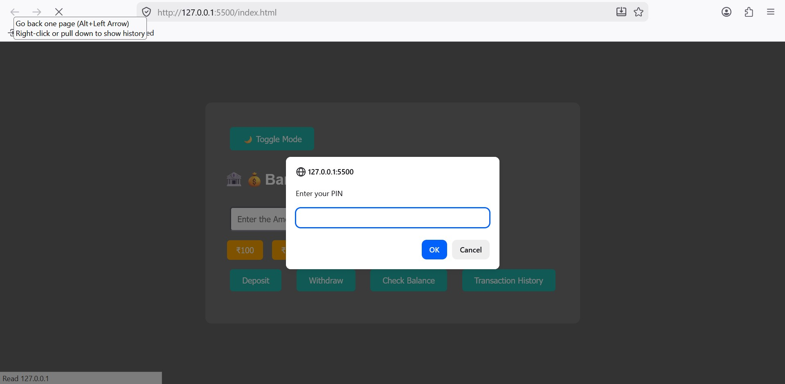
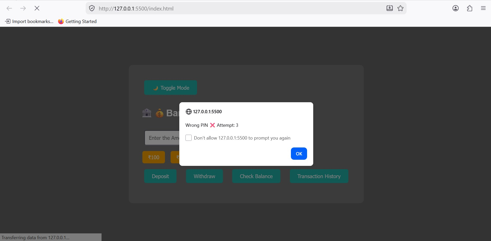
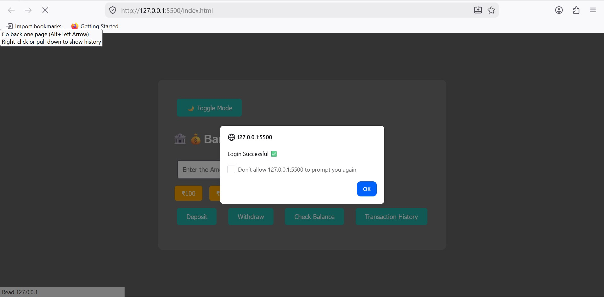
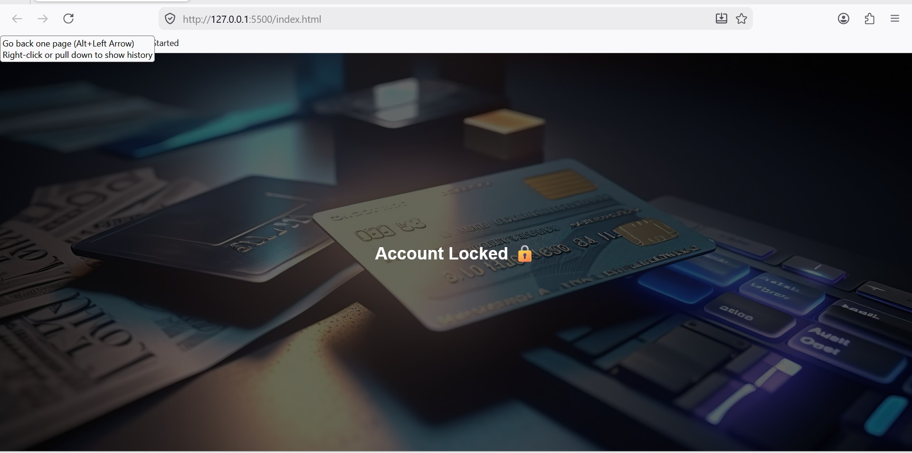
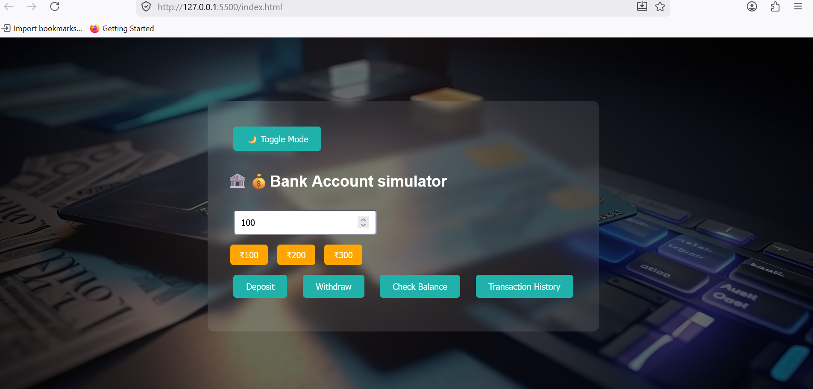
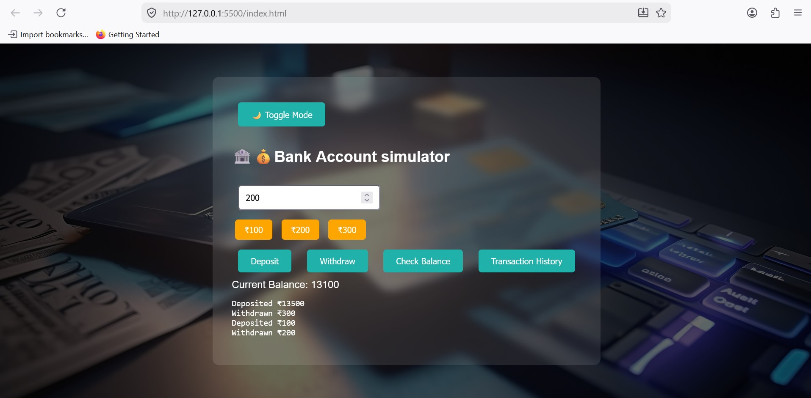

# Bank Account Simulator

# Project Description
A simple banking web application built using html, css, and javascript. It simulates real-world banking operations like login authentication, deposit, withdraw, balance checking, and transaction history with real-time updates.

# Features
- User login system with 3-attempt limit  
- Account lock mechanism after failed attempts  
- Login success validation  
- Deposit functionality  
- Withdraw functionality  
- Real-time balance update  
- Transaction history tracking  
- Minimum balance validation  
- Dark / Light mode toggle  

# Tech Stack
- Html  
- Css  
- Javascript  

# Screenshots

# Login Page

# Login Attempt

# Login Success

# Account Locked

# Dashboard

# Transaction History

# How to Run
- Clone or download this repository  
- Open `index.html` in any browser  
- Start using the application  

# What i Learned
- Dom manipulation using javascript  
- Event handling  
- Form validation  
- Conditional logic building  
- UI state management  
- Building interactive frontend applications
  
# Author
 Pirthika Annadurai
  
- Github: https://github.com/pirthikaannadurai11-aft
  
- Linkedin: https://www.linkedin.com/posts/pirthika-annadurai-7101662a4_webdevelopment-javascript-frontenddevelopment-ugcPost-7452394870679453697-MjGj/?utm_source=share&utm_medium=member_desktop&rcm=ACoAAElZnnwBiJx75khj7eg6vZOHoBRoR6BqHmg

